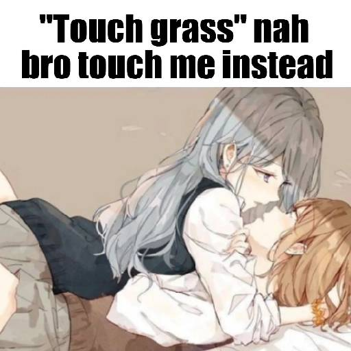

## Hi there!

### Little about me:

Full-stack developer (frontend & backend).

Primary languages: Go and TypeScript. I'm a little dumb for Rust >_<

I run local LLMs with llama.cpp and use function-calling + RAG.

About DevOps... Basic knowledge — Linux, Docker, and all... 

About GameDev... Godot is my god! (pls give me money for development)

### Fun facts:

I have reinstalled my OS ~500+ times over the last few years (estimate: about once a week).

Minecraft is my life!

Not a fan of Plasma/GNOME or Wayland — I prefer X11

