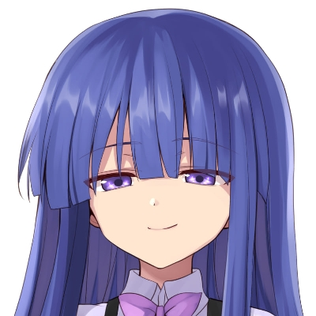

## Hi there! 

### Little about me 

Full-stack developer (frontend & backend).

Primary languages: Go and TypeScript  I'm a little dumb for Rust 

I run local LLMs with llama.cpp and use function-calling + RAG.

About DevOps... Basic knowledge — Linux, Docker, and all... 

About GameDev... Godot is my god! (pls give me money for development)

### Fun facts

I have reinstalled my OS ~500+ times over the last few years (estimate: about once a week).

I play Minecraft.

I'm not a fan of Plasma/GNOME or Wayland — I prefer X11 workflows.
